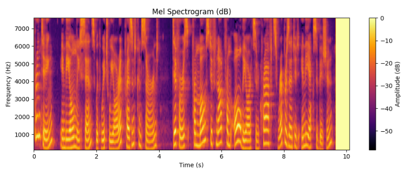
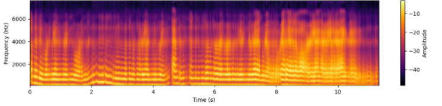
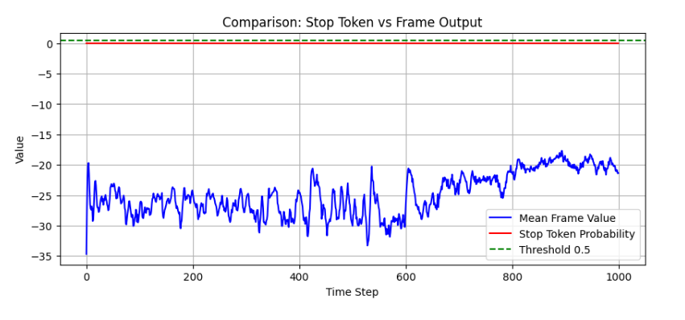
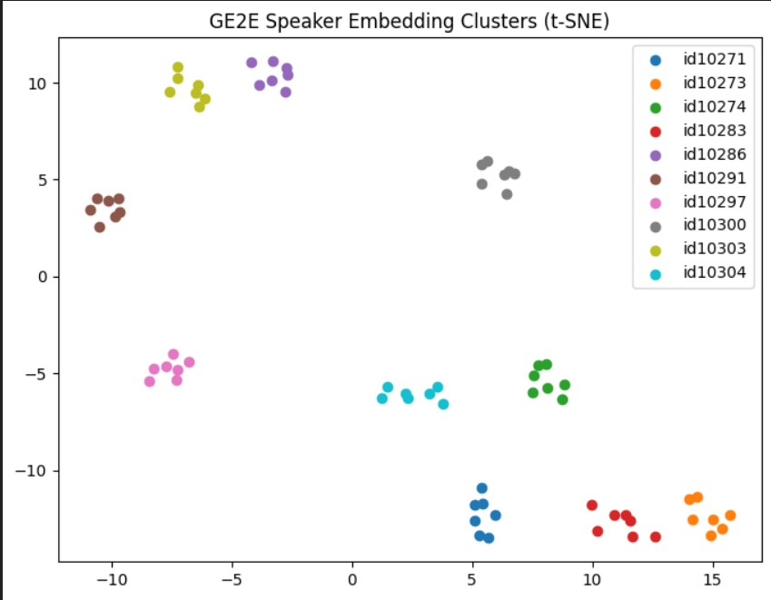
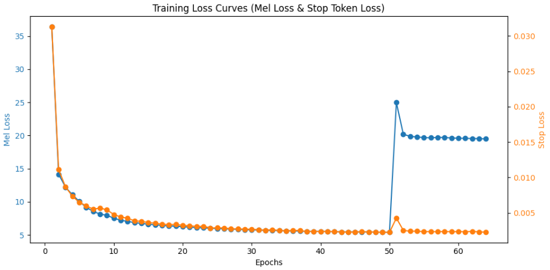

# 🎙️ **Fake My Voice**
> **“Clone any voice. Speak in anyone’s tone.”**

[](https://www.python.org/)
[](https://pytorch.org/)
[](https://opensource.org/licenses/MIT)

**Fake My Voice** is a deep learning–based project focused on voice cloning and speaker-conditioned speech synthesis. The system generates realistic speech that sounds like a specific person using only a few seconds of their audio. 

By combining **Speaker Embeddings**, **Sequence-to-Sequence Synthesis**, and **Neural Vocoding**, we achieve high-quality, human-like output for multi-speaker Text-to-Speech (TTS).

---

## 📖 **Table of Contents**
1. [🌟 About the Project](#-about-the-project)
2. [🎯 Aim](#-aim)
3. [🏗️ Architecture](#-architecture)
4. [🛠️ Tech Stack](#-tech-stack)
5. [📊 Dataset](#-dataset)
6. [📈 Results & Demos](#-results--demos)
7. [📁 File Structure](#-file-structure)
8. [🚧 Challenges Faced](#-challenges-faced)
9. [👥 Contributors](#-contributors)

---

## 🌟 **About the Project**
- 🎧 **Voice Cloning:** Replicate a target speaker's voice with minimal reference audio.
- 🤖 **Deep Learning Pipeline:** Utilizes state-of-the-art models like Tacotron2 and WaveGlow.
- 🔊 **High Quality:** Combines speaker-conditioned synthesis with neural vocoding for natural results.

---

## 🎯 **Aim**
- Build a multi-speaker system capable of replicating tone, accent, and style.
- Implement a unified pipeline consisting of **Tacotron2**, **GE2E Speaker Encoder**, and **WaveGlow**.
- Produce natural speech from text with minimal data per speaker.

---

## ⚙️ **System Overview**
1. **Extract:** Derive a speaker embedding from reference audio.
2. **Synthesize:** Use embedding + text to generate a Mel-spectrogram.
3. **Vocode:** Feed the Mel-spectrogram into a vocoder for waveform generation.
4. **Output:** Deliver speech mimicking the original speaker.

---

## 🛠️ **Tech Stack**

| Category | Tools / Frameworks |
| :--- | :--- |
| **Language** | Python 🐍 |
| **Frameworks** | PyTorch, NumPy, Librosa |
| **Audio Tools** | Torchaudio, SoundFile, Matplotlib |
| **Models** | GE2E Encoder, Tacotron2, WaveGlow |
| **Visualization** | TensorBoard 📈 |

---

## 🏗️ **Architecture**


### 1. **Speaker Encoder (GE2E)** 🧠
- Extracts a fixed-dimensional embedding (**256-D**) capturing vocal identity.
- Uses **Generalized End-to-End (GE2E)** loss to cluster same-speaker embeddings closely and separate different speakers.
- **Input:** Short raw audio samples.
- **Output:** Speaker embedding vector.

### 2. **Speech Synthesizer (Tacotron2)** 🎹
- Converts text to Mel-spectrograms conditioned on the speaker embedding.
- **Encoder:** Processes phoneme/character embeddings with convolutional and recurrent layers.
- **Location-Sensitive Attention:** Ensures smooth, monotonic progression and prevents word-skipping.
- **Decoder:** Autoregressively generates frames using $L1$ loss.

### 3. **Vocoder (WaveGlow)** 🗣️
- Converts high-resolution Mel-spectrograms into time-domain waveforms.
- **Input:** Mel-spectrogram from Tacotron2.
- **Output:** Final waveform audio in the cloned voice.

---

## 📊 **Dataset**

| Dataset | Purpose | Details |
| :--- | :--- | :--- |
| **LJSpeech** | Tacotron2 | ~13k samples, Single Speaker |
| **VoxCeleb** | Speaker Embeddings | ~5k samples, 40 English Speakers |
| **VCTK Corpus** | Merged Model | 44 Hours, 109 English Speakers |

> **Note:** Audio was preprocessed by resampling from 48 kHz to **22.05 kHz**, normalized, and truncated to $\le 4$ seconds.

---

## 📈 **Results & Demos**

### **Tacotron2 Performance**
Achieved smooth Mel-spectrogram prediction after ~60 epochs.

**Text:** *"Printing, in the only sense with which we are at present concerned"*

| Expected Mel | Predicted Mel | Predicted Frames |
| :---: | :---: | :---: |
|  |  |  |

### **Speaker Embeddings**
Achieved stable separation across 40+ speakers. t-SNE plots show distinct identity clustering.


### **Audio Output**
[Download/Listen to Audio Sample](images/model_output_fmv.wav)

> *"Use this model to clone the voice of any user"*

### **Losses & Metrics**
- **Mel Prediction:** Mean Squared Error (MSE) Loss.
- **Stop Token:** Binary Cross-Entropy (BCE) Loss.


---

## 📁 **File Structure**

```bash
Fake_My_Voice/
├── Multi-Speaker-TTS/      # Multi-speaker synthesis logic
├── SingleSpeaker_TTS/      # Baseline TTS code
├── Speaker_Embeddings/     # GE2E extraction scripts
├── datasets.txt            # Training data references
├── requirements.txt        # Project dependencies
└── README.md               # Documentation
```
---

## 🚧 **Challenges Faced**

Working with multi-stage neural TTS pipelines presented several technical hurdles:

* ⚖️ **Length Mismatch:** Resolving discrepancies between Mel-spectrogram frames and waveform samples during loss calculation.
* 🎧 **Sampling Rate Consistency:** Standardizing audio from various sources (48 kHz to 22.05 kHz) to ensure uniform feature extraction.
* 🔋 **GPU Optimization:** Managing the high VRAM footprint of Tacotron2 and WaveGlow, especially during concurrent training.
* 🔇 **Alignment Stability:** Tackling "silent outputs" or word skipping by fine-tuning the location-sensitive attention mechanism.
* 📈 **Embedding Sensitivity:** Ensuring training convergence by prioritizing high-quality, distinct speaker embeddings from the GE2E encoder.

---

## 👥 **Contributors**

We are a team of passionate developers exploring the intersection of Speech Synthesis and Deep Learning.

* 💻 **Aryan Doshi**
* 💻 **Dhiraj Shirse**
* 💻 **Nihira Neralwar**

---

## 🎓 **Mentors**

A special thanks to our mentors for their technical guidance and support throughout the project:

* **Kevin Shah**
* **Prasanna Kasar**
* **Yash Ogale**

---

## 📜 **Acknowledgements & References**

### **Community & Organizations**
- **Community of Coders (CoC)** and **Project X VJTI** for providing the platform and resources to build this project.

### **Research Papers**
- 📄 [Tacotron2: Natural TTS Synthesis by Conditioning WaveNet on Mel Spectrogram Predictions](https://arxiv.org/pdf/1712.05884)
- 📄 [GE2E: Generalized End-to-End Loss for Speaker Verification](https://arxiv.org/pdf/1710.10467)
- 📄 [WaveGlow: A Flow-based Generative Network for Speech Synthesis](https://arxiv.org/pdf/1811.00002)

### **Datasets & Implementations**
- 📂 [LJSpeech Dataset](https://www.kaggle.com/datasets/dromosys/ljspeech)
- 📂 [VoxCeleb Dataset](https://www.kaggle.com/datasets/bachng/voxceleb)
- 📂 [VCTK Corpus Dataset](https://www.kaggle.com/datasets/pratt3000/vctk-corpus)
- 🛠️ [NVIDIA Tacotron2 + WaveGlow PyTorch Implementation](https://github.com/NVIDIA/tacotron2)

---
<p align="center">Made with ❤️ by the Fake My Voice Team</p>
